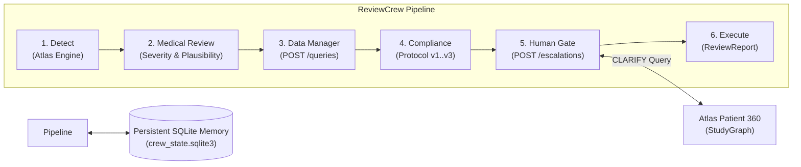

# Stage 2 Monitor Crew — Architecture Specification

## 1. System Overview
Problem 2 (MONITOR) extends the deterministic Stage 1 Atlas knowledge engine into an autonomous, cut-aware clinical review team. The **ReviewCrew** coordinates six sequential review nodes to evaluate incoming clinical data cuts, generate actionable site queries, enforce protocol compliance, manage medical monitor escalations, and maintain cross-cycle state across cuts.



---

## 2. Six-Node Sequential Pipeline

### Node 1: `detect`
- **Function**: Executes the underlying Stage 1 `Atlas` engine and protocol rule checkers without interface modification.
- **Scope**: Scans all 8 clinical domains (`DM`, `AE`, `LB`, `EX`, `CM`, `DS`, `MH`, `EG`) for raw anomalies, dosing mismatches, laboratory excursions, and safety signals.
- **Key Check**: Catches miscoded SAEs where `AESHOSP == 'Y'` even if `AESER == 'N'`, labeling them as `SAE_MISCODED`.

### Node 2: `medical_review`
- **Function**: Evaluates each raw finding for clinical severity (`CRITICAL`, `HIGH`, `MEDIUM`, `LOW`) and biological plausibility.
- **False Alarm Filtering**:
  - For liver transaminase spikes (`HYS_LAW_CANDIDATE`), evaluates the subject's baseline screening ALT. If screening ALT was already elevated ($> 2 \times \text{ULN}$), downgrades the finding to `monitor_only` rather than an immediate dosing hold escalation.
  - Serious adverse events (`SERIOUS_AE`, `SAE_MISCODED`) are classified as `CRITICAL` escalations requiring expedited reporting.
  - Data discrepancies and recording issues are routed to `query`.
- **Multi-Cycle Escalation**: Subjects flagged across distinct historical data cuts are automatically elevated to medical review escalation.

### Node 3: `data_manager`
- **Function**: Converts data entry discrepancies (e.g., event dates prior to first dose, dosing inconsistencies, unit mismatches) into formal clinical site queries.
- **Dispatch**: Formats payload citing exact evidence keys `(domain, usubjid, sequence)` and dispatches to `POST /queries`.
- **Deduplication**: Enforces strict idempotency on `(domain, usubjid, sequence, code)`. Duplicate issues across cycles generate $0$ redundant queries.

### Node 4: `compliance`
- **Function**: Evaluates subject data dynamically against the protocol version active at the specified cut:
  - **Protocol v1** (Cuts 1–4): Core eligibility criteria and baseline visit windows.
  - **Protocol v2** (Cuts 5–8): Introduces renal exclusion (Creatinine $> 1.5 \text{ mg/dL}$) and updated concomitant medication rules.
  - **Protocol v3** (Cuts 9–12): Final study amendments and compliance rules.
- **Site-Level Tracking**: Aggregates compliance deviations by clinical site. When a site accumulates 2+ deviations across subjects, generates a persistent `site_flag`.

### Node 5: `human_gate`
- **Function**: Manages the escalation lifecycle with the Medical Monitor via `POST /escalations`.
- **Tri-State Monitor Response Handling**:
  1. **`APPROVED`**: Executes the recommended action (e.g. subject discontinuation or safety notification), records the decision in `actions`, and logs to trace.
  2. **`REJECTED`**: Downgrades the finding to ongoing monitoring with the stated monitor rationale; persists the rejection key in SQLite memory so it is **never re-escalated** in future cycles.
  3. **`CLARIFY`**: Automatically queries `atlas.graph.patient360(usubjid)` to extract requested clinical history (e.g. screening transaminases, bilirubin, concomitant hepatotoxic medications), formats the evidence-backed answer, and **resubmits the escalation in the same cycle run**. Never treats `CLARIFY` as a rejection.

### Node 6: `execute`
- **Function**: Finalizes all executed actions, aggregates cycle metrics (findings, queries, escalations, deviations, site flags, suppressed duplicates), and returns the complete `ReviewReport`.
- **Real-Time Tracing**: Every decision is streamed to `trace.jsonl` and the SQLite trace table with timestamps, node identifiers, and evidence citations.

---

## 3. Persistent Memory & Idempotency Design

Memory is stored in `stage2/crew_state.sqlite3` with Write-Ahead Logging (WAL):

| Store Key | Type | Purpose |
|---|---|---|
| `query_keys` | `Set[str]` | Hash of `(domain, usubjid, seq, code)` to prevent re-querying identical records. |
| `escalation_keys` | `Set[str]` | Hash of `(code, usubjid, site)` to avoid duplicate open escalations. |
| `rejected_escalations` | `Set[str]` | Records rejected by monitor to permanently suppress re-escalation. |
| `subject_cuts` | `Dict[str, List[int]]` | Distinct data cut numbers where subject had findings; triggers multi-cut escalation. |
| `site_flags` | `Dict[str, int]` | Cumulative count of compliance deviations per clinical site. |
| `trace` table | `SQLite Table` | Chronological log of all node decisions and payload traces. |

**Cross-Cycle Guarantee**: Re-running the exact same cut generates exactly **0 new queries** and **0 new escalations**.

---

## 4. Execution Trace Format

Each decision is logged instantaneously in real time:
```json
{
  "timestamp": "2026-09-19T04:00:00.000000+00:00",
  "node": "human_gate",
  "action": "clarification_resubmitted",
  "cut": 6,
  "protocol_version": 2,
  "escalation_id": "E-1",
  "answer": "For subject 042-S07-001: Screening ALT was 0.27 ukat/L (LB seq 1); AST was 0.197 ukat/L (LB seq 2); Bilirubin was 0.69 mg/dL (LB seq 3); 3 concomitant medication(s) reported (Glibenclamide, Amlodipine, Omeprazole).",
  "api_result": {"status": "OK", "http_status": 200}
}
```
